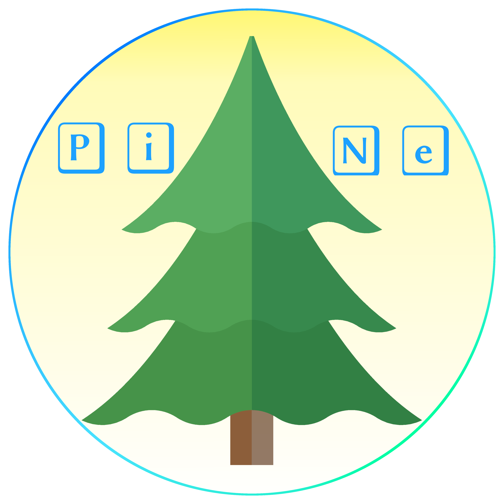

<link rel="stylesheet" type="text/css" media="all" href="assets/style.css" />

[1]: https://www.docker.com/
[2]: https://luca-lc.github.io/
[3]: https://plex.tv/ 

# PiNe
 

#### Containerized online services 

Author: <a href="https://luca-lc.github.io/">luca-lc</a>

## Introduction

PiNe provides a containerized system to put some web services online. PiNe is also a simple way to keep the entire system updated, maintained and isolated from underlying system. Using PiNe is also usefull to keep each contaier isolated for others, in this way if a fault is rised in one of them, the others continue to run. The system is based on the [Docker-CE][1] engine from a maintainer idea after struggling with the same services hosted directetly on the OS.

### Description

PiNe containes
- <u>[FTPiNe](#FTPiNe)</u>: a File Transfer Protocol server
- <u>[Plex][3]</u>: a Media Server
- <u>[PiNeBox](#PiNeBox)</u>: a cloud service
- <u>PiNeSites</u>: a hosting for sites building, testing and presentation
- <u>PiNeSQL</u>: a relational DBMS

All containers are accessible using a ReverseProxy.

#### _FTPiNe_

The server FTP is based on `vsftpd` engine. At the building image, the system copies the configuration files and the configuration script into the image.
Into the `vsftpd` configuration file, called `vsftpd.conf`, are setted the environment variables, like the writting permissions, users list and `chroot` to restrict users to thier home directory.
Instead, into the `configFile.conf` there are the users name and users password signed up at the service
Into the `vsftpd.userlist` there are the list of the users allowed to access.

#### _Plex_
TODO

#### _PiNeBox_

